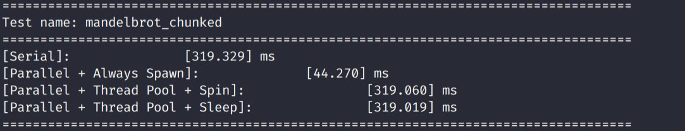
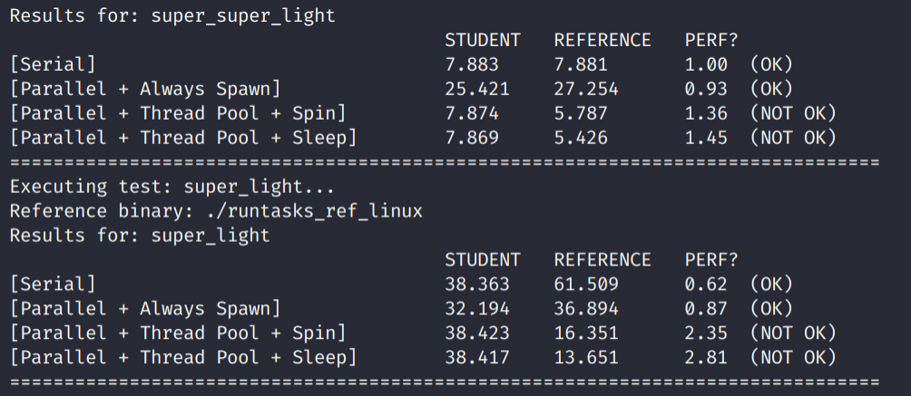

# Assignment 2

## Part A

First, we should understand the file `itasksys.h`. It defines two
abstract classes `IRunable` and `ITaskSystem`.

```c++
class IRunable {
public:
  virtual ~IRunnable();
  virtual void runTask(int task_id, int num_total_tasks = 0) = 0;
};
```

It is obvious that the user should define the `IRunable` class.
And the `runTask` is provided by the user. And the core class is `ITaskSystem`.

```c++
class ITaskSystem {
public:
  ITaskSystem(int num_threads);
  virtual ~ITaskSystem();
  virtual const char* name() = 0;
  virtual void run(IRunnable* runnable, int num_total_tasks) = 0;
  virtual TaskID runAsyncWithDeps(IRunnable* runnable, int num_total_tasks,
                                  const std::vector<TaskID>& deps) = 0;
  virtual void sync() = 0;
}
```

For `ITaskSystem::run()`, it executes a bulk task launch of `num_total_tasks`.
Task execution is synchronous with the calling thread, so it will return only
when the execution of all tasks is complete.

For `ITaskSystem::runAsyncWithDeps`, Executes an asynchronous bulk task launch of
`num_total_tasks`, but with a dependency on prior launched tasks.

In part A, we do not consider about the `ITaskSystem::runAsyncWithDeps`.

### Serial Program

We first look at class `TaskSystemSerial`. The function `run` is defined as follow.

```c++
void TaskSystemSerial::run(IRunnable* runnable, int num_total_tasks) {
  for (int i = 0; i < num_total_tasks; i++) {
    runnable->runTask(i, num_total_tasks);
  }
}
```

### Step 1

The most simplest answer is just to make the `run` function
as the master, and create the threads to do the job. And join the thread at last.
(However, I use C++14 for better lambda function).

```c++
void TaskSystemParallelSpawn::run(IRunnable* runnable, int num_total_tasks) {
    auto thread_func = [runnable_ = runnable, num = _num_threads, total = num_total_tasks](int i) {
        while(i < total) {
            runnable_->runTask(i, total);
            i += num;
        }
    };
    std::thread threads[_num_threads];
    for (int i = 0; i < _num_threads; ++i) {
      threads[i] = std::move(std::thread(thread_func, i));
    }
    for (int i = 0; i < _num_threads; ++i) {
      threads[i].join();
    }
}
```

This is actually correct. We execute the normal tests.



Next, do the performance test.



### Step 2

Well, it is not so easy to write a thread loop. There are so many details
we need to deal with. The most important thing here is do remember `join`
the thread whe the class's lifetime ends.

It may seem that we need to accept every index to dynamic choose what to do.
This is a stupid idea. Remember, we should reduce the size of synchronization.
So we use the idea of step 1.

And you could see the following code for details. First we should add some
private members.

```c++
private:
  int _num_threads; // to store the threads
  std::vector<std::thread> threads; // thread poll
  unsigned int jobs = 0x00; // bitmap value for indicating whether there is a job
  unsigned int bitmap_init_value = 0x00; // initialized bitmap value with 0x1111
  IRunnable* runnable_; // we need to record the runnable
  std::mutex queue_mutex; // the big lock
  bool terminate = false; // Whether we should terminate the thread
  int total_tasks = 0;    // we should record the total task
  void start(int num_threads); // start the thread pool
  void threadLoop(int i); // thread functionaility
  bool busy(); // whether the threads are busy doing their jobs
```

For constructor, we need to initialize the `bitmap_init_value` and start the thread pool.

```c++
TaskSystemParallelThreadPoolSpinning::TaskSystemParallelThreadPoolSpinning(int num_threads)
  : ITaskSystem(num_threads), _num_threads(num_threads) {
  unsigned int init = 0x01;
  for(int i = 0; i < _num_threads; ++i) {
    bitmap_init_value |= init;
    init <<= 1;
  }
  start(_num_threads);
}
```

For `start`, it is easy to understand.

```c++
void TaskSystemParallelThreadPoolSpinning::start(int num_threads) {
  threads.resize(num_threads);
  for(int i = 0; i < num_threads; ++i) {
    threads[i] = std::move(std::thread(&TaskSystemParallelThreadPoolSpinning::threadLoop, this, i));
  }
}
```

Now, we come the most important part. For how to tell whether there is a job
for the thread, we use `jobs` as a bit map. And when the job is finished, we
make the corresponding to 0.

```c++
void TaskSystemParallelThreadPoolSpinning::threadLoop(int i) {
  while(true && !terminate) {
    bool flag = false;
    {
      std::lock_guard<std::mutex> guard{queue_mutex};
      flag = (jobs >> i) & 0x01;
    }
    if(flag) {
      int taskId = i;
      while(taskId < total_tasks) {
        runnable_->runTask(taskId, total_tasks);
        taskId += _num_threads;
      }
      {
        std::lock_guard<std::mutex> guard{queue_mutex};
        jobs &= ~(0x01 << i);
      }
    }
  }
}
```

When the other calls `run`, it first initialize `jobs` to `bitmap_init_value`. And
set the corresponding `runnable_` and the number of tasks. And if the `jobs` becomes
0, all the threads have competed their jobs. Thus, we can return.

```c++
void TaskSystemParallelThreadPoolSpinning::run(IRunnable* runnable, int num_total_tasks) {
  total_tasks = num_total_tasks;
  runnable_ = runnable;
  {
    std::lock_guard<std::mutex> guard{queue_mutex};
    jobs = bitmap_init_value;
  }
  while(busy());
}
```

Do remember join the threads at the destructor:

```c++
TaskSystemParallelThreadPoolSpinning::~TaskSystemParallelThreadPoolSpinning() {
  /*
    * Here, we don't need to synchronize the code, because
    * the thread will never write `terminate`. No matter
    * the thread may read some corrupted value, this doesn't matter.
  */
  terminate = true;
  for(int i = 0; i < _num_threads; ++i) {
    threads[i].join();
  }
}
```

### Step 3

In the step 2, we have pushed all the threads and `run` spin, which is inefficient.
So we should make them sleep. The idea here is simple. We just use condition variables
to achieve that. It is just consumer and producer problem.

### Conclusion for Part A

I wanna say sometimes spin is better than sleep. Because sleep would cause context switch,
which may be inefficient when cpu speed is high.
