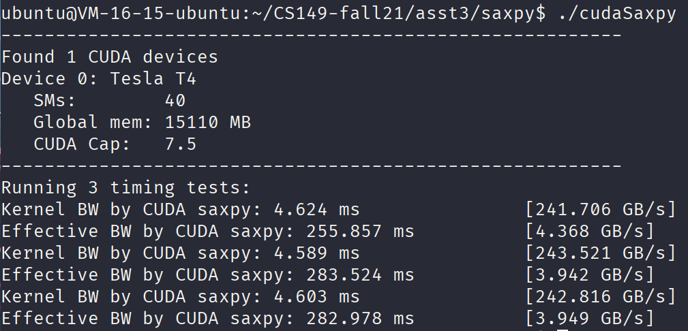
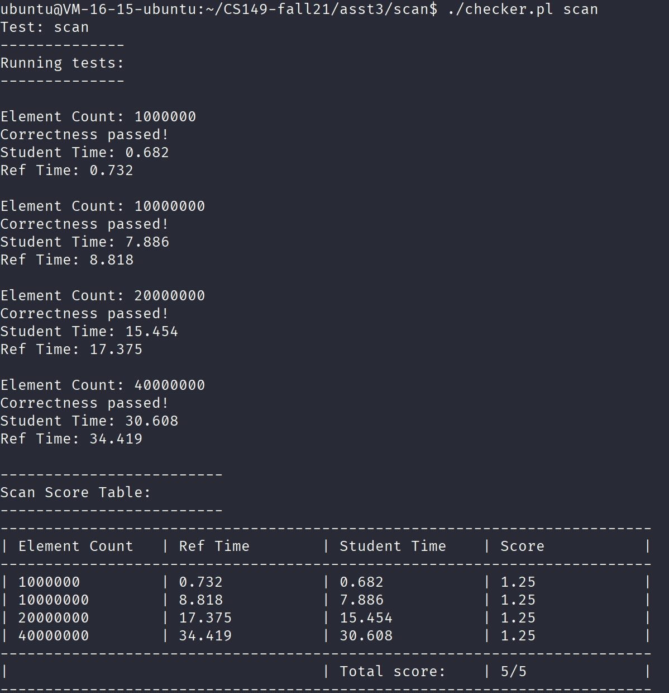
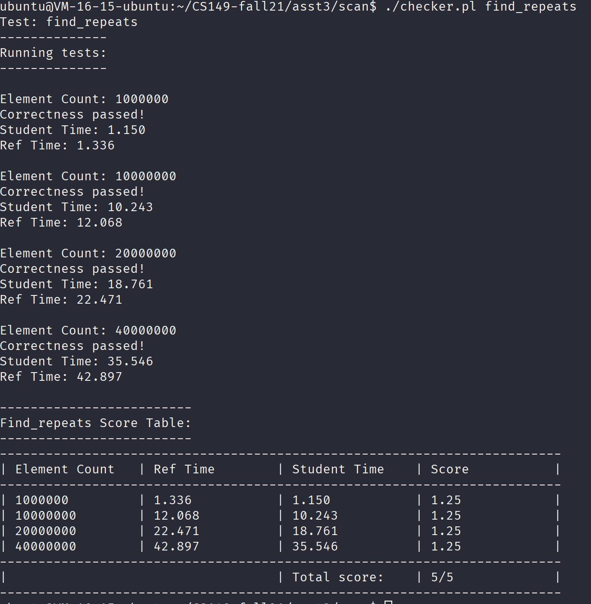
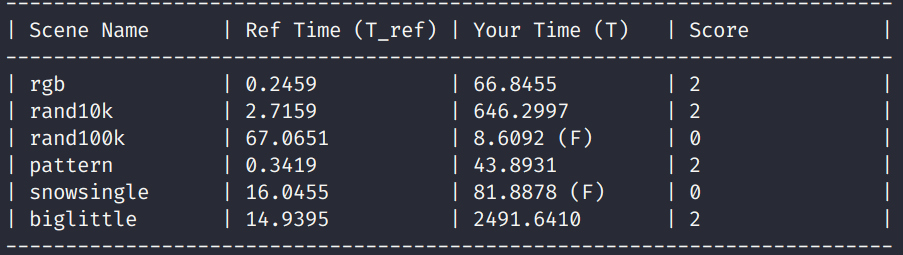

# Assignment 3

## Part 1

The result is illustrated in the following figure.



### Question 1

As you can see, due to the parallelism of the GPU, the bandwidth is huge.

### Question 2

From the results, we can get that the bottleneck is the memory and CPU of the host itself.
For the execution time of the kernel, the speed is very fast. However, the speed is low
for copying the host memory into the device memory and vice versa.

## Part 2

First, we need to implement the parallelism form of `scan`. The algorithm is super wonderful.
You should first understand the algorithm.

```c
void exclusive_scan_iterative(int* start, int* end, int* output) {

    int N = end - start;
    memmove(output, start, N*sizeof(int));

    // upsweep phase
    for (int two_d = 1; two_d <= N/2; two_d*=2) {
        int two_dplus1 = 2*two_d;
        parallel_for (int i = 0; i < N; i += two_dplus1) {
            output[i+two_dplus1-1] += output[i+two_d-1];
        }
    }

    output[N-1] = 0;

    // downsweep phase
    for (int two_d = N/2; two_d >= 1; two_d /= 2) {
        int two_dplus1 = 2*two_d;
        parallel_for (int i = 0; i < N; i += two_dplus1) {
            int t = output[i+two_d-1];
            output[i+two_d-1] = output[i+two_dplus1-1];
            output[i+two_dplus1-1] += t;
        }
    }
}
```

It may seem that we need `N` threads for every inner loop, however, this
is a stupid idea, we should calculate how many threads we need for each
inner loop.

The result is below:



When dealing with finding repeats. Things would be a little tricky. However,
it is not difficult.



## Part 3

Before diving into how to write a render using CUDA. We first think about how
to implement a render with cpp. And after that, you need to read the code
written with CUDA.

### First Implementation

For the first implementation, I focus on how to write the correct code. The hint
part `exclusive_scan` has made me think we could first store the circle render
parameters for each pixel. Thus we can scan the circle render parameters for each pixel.

Thus, we can solve the two important questions:

+ *Atomicity*: we have made the memory independent for each pixel. So we can write whatever
we want without any synchronization and mutation.
+ *Order*: We have make an explicit array of render parameters. So the order doesn't matter.

So, We first need to construct an array to hold the render parameters for each pixel.

```c++
cudaMalloc(&cudaDevicePixelData, image->width * image->height * numCircles * 4 * sizeof(float));
```

Now, we first write the render information for every pixel. The core code is below:

```c++
    int pixelPtrStart = 4 * cuConstRendererParams.numCircles * (pixelY * imageWidth + pixelX) + 4 * circleIndex;
    float4* pixelPtr = (float4*)(&cuConstRendererParams.pixelData[pixelPtrStart]);
    float4 color;
    color.x = rgb.x;
    color.y = rgb.y;
    color.z = rgb.z;
    color.w = alpha;

    *pixelPtr = color;
```

Then we can launch a new kernel to calculate for each pixel:

```c++
for (int i = 0; i < numCircles; ++i) {
    float4* pixelPtr = (float4*)(&cuConstRendererParams.pixelData[startIndex + i * 4]);
    color.x = (*pixelPtr).w * (*pixelPtr).x + (1 - (*pixelPtr).w) * color.x;
    color.y = (*pixelPtr).w * (*pixelPtr).y + (1 - (*pixelPtr).w) * color.y;
    color.z = (*pixelPtr).w * (*pixelPtr).z + (1 - (*pixelPtr).w) * color.z;
    color.w += (*pixelPtr).w;
  }
  *imagePtr = color;
```

However, `cudaDevicePixelData` is too big, which will consume so much memory, which would
exceed the maximum memory 16GB. So we need to reuse the render information. We should
not store the information for every pixel. Because the render information of each circle is deterministic. But the things we need to make sure is that whether the circle has contributed
to the pixel. So instead of storing the render information for each pixel, we could just use
bit mask to indicate whether the circle has contributed to the pixel.

Now, the result is illustrated by below.



As you can see, we have passed some tests and the performance is not good at all. The reason why
there are some failed tests is that the bytes exceed $2^{63}$, which would overflow.
