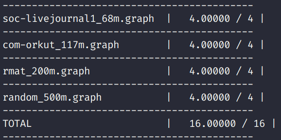

# Assignment 4

Before we dive into the assignment. We need to understand the data
structure of the graph. You should carefully read the code to understand.
I omit detail here.

## Part 1

Before we use OpenMP to parallelize the code. We just first write the serial
form. It is easy.

```c++
void pageRank(Graph g, double* solution, double damping, double convergence) {


  // initialize vertex weights to uniform probability. Double
  // precision scores are used to avoid underflow for large graphs

  int numNodes = num_nodes(g);
  double equal_prob = 1.0 / numNodes;
  for (int i = 0; i < numNodes; ++i) {
    solution[i] = equal_prob;
  }

  double* tempArray = new double[g->num_nodes];


  bool converged = false;
  while (!converged) {
    for (Vertex v = 0; v < g->num_nodes; ++v) {
      tempArray[v] = 0.0;
    }
    for (Vertex v = 0; v < g->num_nodes; ++v) {
      for (const Vertex* iv = incoming_begin(g, v); iv != incoming_end(g, v); ++iv) {
        tempArray[v] += solution[*iv] / static_cast<double>(outgoing_size(g, *iv));
      }
    }
    for (Vertex v = 0; v < g->num_nodes; ++v) {
      tempArray[v] = tempArray[v] * damping + (1.0 - damping) / static_cast<double>(numNodes);
    }

    double t = 0.0;
    for (Vertex v = 0; v < g->num_nodes; ++v) {
      if(outgoing_size(g, v) == 0) {
          t += damping * solution[v] / static_cast<double>(numNodes);
      }
    }

    for (Vertex v = 0; v < g->num_nodes; ++v) {
      tempArray[v] += t;
    }

    double globalDiff = 0.0;
    for (Vertex v = 0; v < g->num_nodes; ++v) {
      globalDiff += abs(tempArray[v] - solution[v]);
    }
    for (Vertex v = 0; v < g->num_nodes; ++v) {
      solution[v] = tempArray[v];
    }
    converged = globalDiff < convergence;
  }

  delete[] tempArray;
}
```

Now we can use OpenMP to parallelize the code above.


