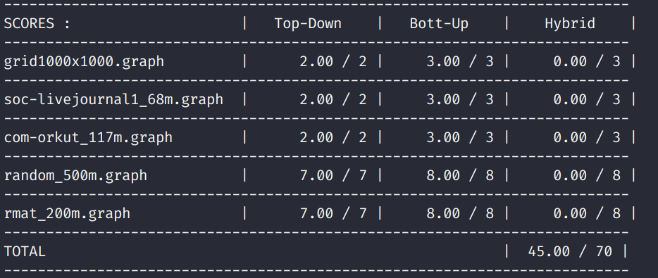

# Assignment 4

Before we dive into the assignment. We need to understand the data
structure of the graph. You should carefully read the code to understand.
I omit detail here.

## Part 1

Before we use OpenMP to parallelize the code. We just first write the serial
form. It is easy.

```c++
void pageRank(Graph g, double* solution, double damping, double convergence) {


  // initialize vertex weights to uniform probability. Double
  // precision scores are used to avoid underflow for large graphs

  int numNodes = num_nodes(g);
  double equal_prob = 1.0 / numNodes;
  for (int i = 0; i < numNodes; ++i) {
    solution[i] = equal_prob;
  }

  double* tempArray = new double[g->num_nodes];


  bool converged = false;
  while (!converged) {
    for (Vertex v = 0; v < g->num_nodes; ++v) {
      tempArray[v] = 0.0;
    }
    for (Vertex v = 0; v < g->num_nodes; ++v) {
      for (const Vertex* iv = incoming_begin(g, v); iv != incoming_end(g, v); ++iv) {
        tempArray[v] += solution[*iv] / static_cast<double>(outgoing_size(g, *iv));
      }
    }
    for (Vertex v = 0; v < g->num_nodes; ++v) {
      tempArray[v] = tempArray[v] * damping + (1.0 - damping) / static_cast<double>(numNodes);
    }

    double t = 0.0;
    for (Vertex v = 0; v < g->num_nodes; ++v) {
      if(outgoing_size(g, v) == 0) {
          t += damping * solution[v] / static_cast<double>(numNodes);
      }
    }

    for (Vertex v = 0; v < g->num_nodes; ++v) {
      tempArray[v] += t;
    }

    double globalDiff = 0.0;
    for (Vertex v = 0; v < g->num_nodes; ++v) {
      globalDiff += abs(tempArray[v] - solution[v]);
    }
    for (Vertex v = 0; v < g->num_nodes; ++v) {
      solution[v] = tempArray[v];
    }
    converged = globalDiff < convergence;
  }

  delete[] tempArray;
}
```

Now we can use OpenMP to parallelize the code above.


## Part 2

### Top Down BFS

It is easy to parallelize the code. For each frontier, we handle it
concurrently. And we simply uses `#pragma omp critical` to protect
the shared data `new_frontier`. However, it is too slow. So the grade
is slow.


So we should avoid using locks. If we want to avoid locks, we need to
store the state like global count. However, there are some details you
should look at the code.


### Bottom Up BFS

The Top Down BFS is a easy job to do actually. Because it is a prior algorithm.
However, in the code, we would do many logical operations especially the frontier
size is large and its ancestors' size is small. Look at the following code snippet,
which would cause so many logical operations.

```c++
if (distances[outgoing] == NOT_VISITED_MARKER &&
  __sync_bool_compare_and_swap(&distances[outgoing], NOT_VISITED_MARKER, distances[node] + 1)) {
    int index = localList[omp_get_thread_num()].count++;
    localList[omp_get_thread_num()].vertices[index] = outgoing;
}
```

Well, I cannot understand the principle of Bottom Up BFS. So I decide to read an essay
which is called [Direction-optimizing breadth-first-search](https://downloads.hindawi.com/journals/sp/2013/702694.pdf).

I think the paper is enough. So I omit detail here. You should carefully read the paper.
And I record some information here.

> The majority of the computational work in BFS is checking edges of the frontier
> to see if the endpoint has been visited. The total number of edge checks in the
> conventional top-down algorithm is equal to the number of edges in the connected
> component containing the source vertex, as on each step every edge in the
> frontier is checked.

Well, at now the bottom-up way is clear. For every step, we just traverse all the vertices.
And we have the current `frontier` information. From Top Down BFS, we need to check for
every vertex's neighbor to add it to the `next_frontier`. In the Bottom Up BFS, we just
find whether the `child` is the ancestor of the vertices in the `frontier`.

Now we can code.

```c++
uint bottom_up_step(Graph g, bool* frontier, bool* new_frontier, int* distances) {
    uint count = 0;
    #pragma omp parallel for reduction(+: count)
    for (int i = 0; i < g->num_nodes; ++i) {
        if (distances[i] == NOT_VISITED_MARKER) {
            for (const Vertex* incoming = incoming_begin(g, i); incoming != incoming_end(g, i); ++incoming) {
                if (frontier[*incoming]) {
                    distances[i] = distances[*incoming] + 1;
                    new_frontier[i] = true;
                    count += 1;
                    break;
                }
            }
        }
    }
    return count;
}

void bfs_bottom_up(Graph graph, solution* sol)
{

    bool *frontier = new bool[graph->num_nodes];
    bool *new_frontier = new bool[graph->num_nodes];

    bool *current = frontier;
    bool *next = new_frontier;

    #pragma omp parallel for
    for (int i = 0; i < graph->num_nodes; ++i) {
        current[i] = false;
    }

    // Set for the root node
    current[ROOT_NODE_ID] = true;

    #pragma omp parallel for
    // initialize all nodes to NOT_VISITED
    for (int i=0; i<graph->num_nodes; i++)
        sol->distances[i] = NOT_VISITED_MARKER;
    sol->distances[ROOT_NODE_ID] = 0;

    uint count = 1;

    while (count != 0) {

        #pragma omp parallel for
        for (int i = 0; i < graph->num_nodes; ++i) {
            next[i] = false;
        }

        count = bottom_up_step(graph, current, next, sol->distances);

        // Swap the pointer
        bool * temp = next;
        next = current;
        current = temp;

    }
    delete[] frontier;
    delete[] new_frontier;
}
```

However, the result is illustrated below.


As you can see, I cannot get the full grades. I am wondering the reason.
You could look at this [article](http://www.nic.uoregon.edu/~khuck/ts/acumem-report/manual_html/ch06s07.html).

And the article provides some tips:

+ Avoid writing to global data that is accessed from multiple threads.
+ Align shared global data to cache line boundaries.
+ Don't store temporary, thread specific data in an array indexed by th thread id or rank.
+ When parallelizing an algorithm, partition data sets along cache lines, not across cache lines.

The last tip is what we could do. So we could use `schedule(dynamic, chunk_size)` for openmp to
improve efficiency.



### Hybrid BFS

The pairing of the top-down approach with the bottom-up approach is complementary, since
when the frontier is largest, the bottom-up approach will be at its best
whereas the top-down approach will be at its worst, and vice versa.

So the idea is simple. Uses the Top Down BFS for steps when the frontier is large. We begin
each search with the Top Down BFS and continue until the frontier becomes too large, at which
point we switch to the Bottom Up BFS.

You should see the above paper for details.


